# Operations Guide

## Table of Contents

- [Debug release pipeline](#debug-release-pipeline)
- [Retrigger release pipeline](#retrigger-release-pipeline)
- [Check frontend logs](#check-frontend-logs)
- [Check backend logs](#check-backend-logs)
- [Check Postgres logs](#check-postgres-logs)
- [Check Opensearch logs](#check-opensearch-logs)
- [Check metrics](#check-metrics)
- [Debug indexing and clear dead-letter queue for indexing](#debug-indexing-and-clear-dead-letter-queue-for-indexing)
- [Log into running container](#log-into-running-container)
- [Trigger batch upgrade](#trigger-batch-upgrade)
- [Trigger index creation](#trigger-index-creation)
- [Trigger reindexing](#trigger-reindexing)
- [Flip a feature flag](#flip-a-feature-flag)
- [Add new feature flag](#add-new-feature-flag)
- [Connect to Postgres with psql](#connect-to-postgres-with-psql)
- [Connect to Opensearch](#connect-to-opensearch)
- [Restore database snapshot to lower environments](#restore-database-snapshot-to-lower-environments)
- [Swap Opensearch](#swap-opensearch)
- [Swap Postgres](#swap-postgres)

---

## Debug release pipeline

1. Find failed pipeline in CodePipeline console.
2. Identify failed step.
3. Check logs for build steps, or details in CloudFormation `Events` tab for deployment steps:

<p align="center">
  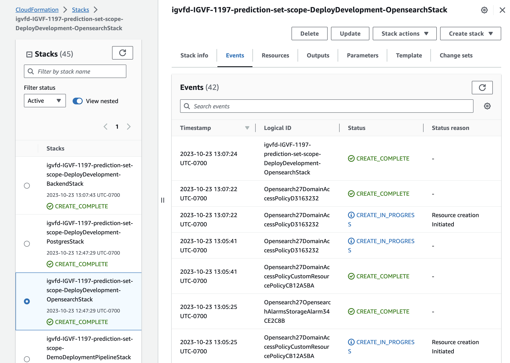
</p>

---

## Retrigger release pipeline

1. Find pipeline in CodePipeline console:

<p align="center">
  
</p>

2. Click on `Release Change` button:

<p align="center">
  
</p>

---

## Check frontend logs

1. Find cluster in ECS console:

<p align="center">
  
</p>

2. Click on `Frontend` service:

<p align="center">
  
</p>

3. Click on `Logs` tab and `View in CloudWatch` button (select `ApplicationContainerLogGroup`):

<p align="center">
  
</p>

4. Add custom time range to narrow down logs:

<p align="center">
  
</p>

---

## Check backend logs

1. Follow [Check frontend logs](#check-frontend-logs) for backend cluster and `Backend` service.

---

## Check Postgres logs

1. Find database in RDS console:

<p align="center">
  
</p>

2. Click on `Monitor` tab to view metrics like CPU utilization:

<p align="center">
  
</p>

3. Click on `Logs` tab and select log to `View`:

<p align="center">
  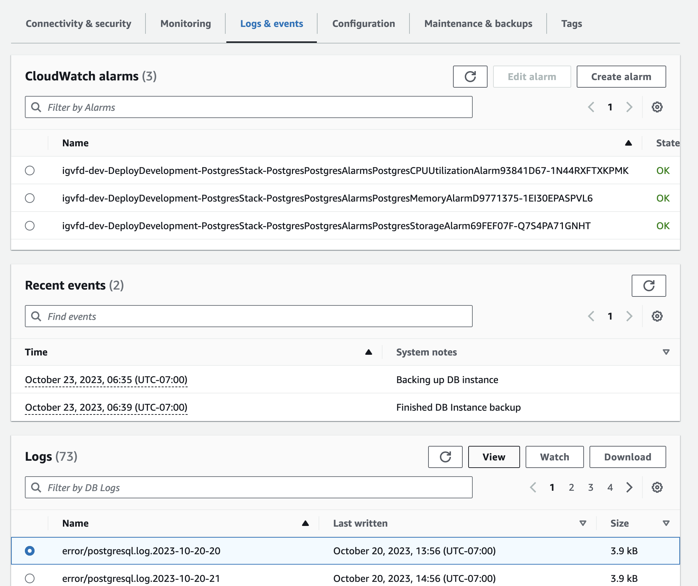
</p>

4. Examine logs:

<p align="center">
  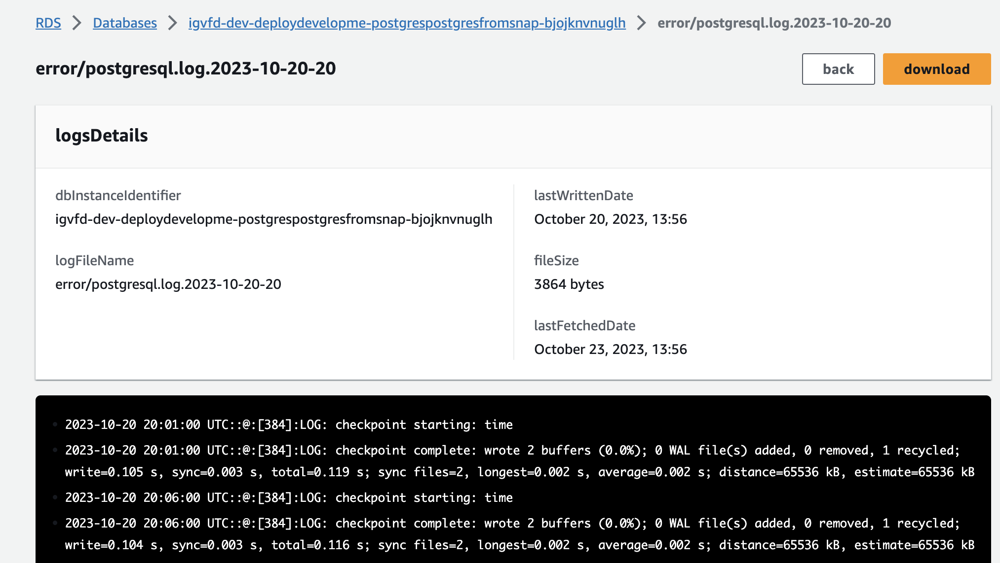
</p>

---

## Check Opensearch logs

1. Find Opensearch cluster in Opensearch console (see #2 for checking tags if name is obscure):

<p align="center">
  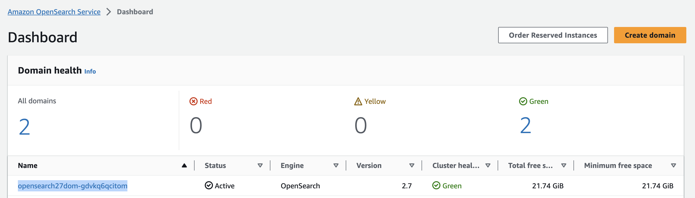
</p>

2. Click on `Tags` tab to ensure cluster corresponds to correct environment:

<p align="center">
  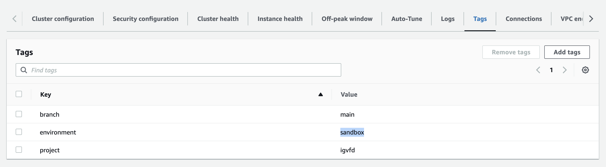
</p>

3. Click on `Cluster health` and `Instance health` tabs to check metrics:

<p align="center">
  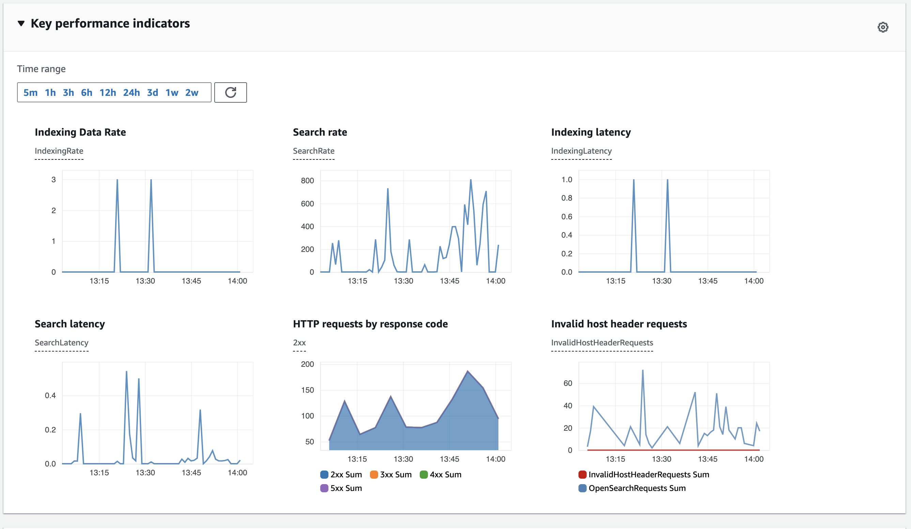
</p>

4. Click on `Logs` tab to view logs:

<p align="center">
  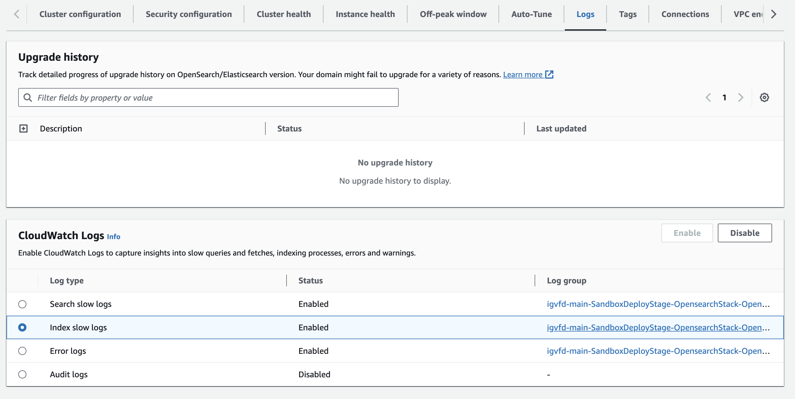
</p>
---

## Check metrics

- See monitoring section of [Check Postgres logs](#check-postgres-logs) for Postgres metrics
- See monitoring section of [Check Opensearch logs](#check-opensearch-logs) for Opensearch metrics

For ECS Fargate:

1. Find cluster in ECS console.
2. Click on service name.
3. Look at `Health and metrics` tab for CPU and memory utilization.

---

## Debug indexing and clear dead-letter queue for indexing

1. Find dead letter queue with messages in SQS console:

<p align="center">
  
</p>

2. Click on `Send and receive messages` button:

<p align="center">
  
</p>

3. Click on `Poll for messages` button:

<p align="center">
  
</p>

4. Open up the message to get the UUID of the object that failed to index:

<p align="center">
  
</p>

5. After cause has been investigated and fixed, click on `Start DLQ redrive` and `DLQ redrive` to send the messages back to primary queue for indexing.

<p align="center">
  
</p>

6. Monitor DLQ to make sure objects index correctly and messages don't reappear.

---

## Log into running container

1. Find cluster in ECS console:

<p align="center">
  
</p>

2. Click on desired service:

<p align="center">
  
</p>

3. Find task ID:

<p align="center">
  
</p>

4. Find container name (if task has multiple containers):

<p align="center">
  
</p>

5. Run command in terminal, filling in cluster, task, container name, and profile:

```bash
aws ecs execute-command \
    --command "/bin/bash" \
    --interactive \
    --cluster igvfd-dev-DeployDevelopment-BackendStack-EcsDefaultClusterMnL3mNNYNDemoVpc278C9613-7BVzDrMc52Ln \
    --task 26f42c00797144ec89393019c15c3d2b \
    --container pyramid \
    --profile igvf-dev
```

---

## Trigger batch upgrade

1. Find BatchUpgrade Rule for environment in EventBridge console:

<p align="center">
  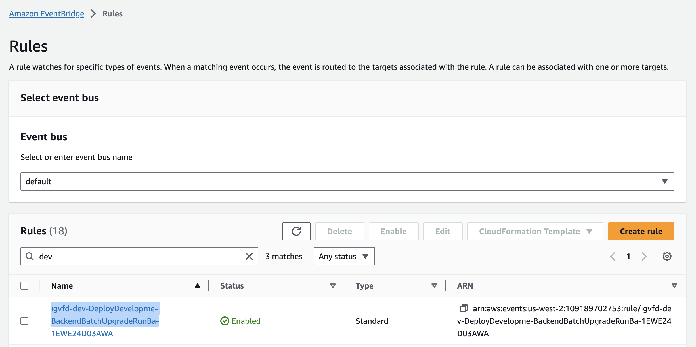
</p>

2. Copy event pattern JSON:

<p align="center">
  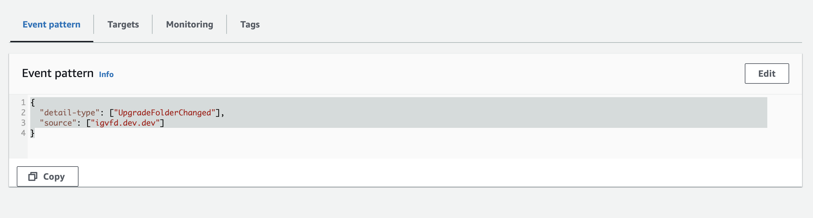
</p>

3. Go to Event buses in EventBridge console and click `Send events`:

<p align="center">
  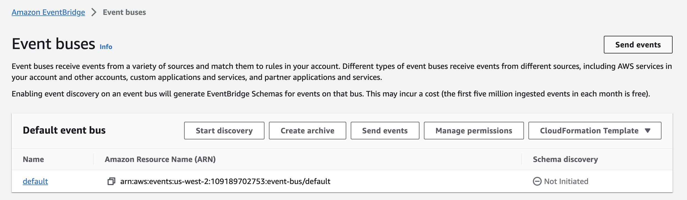
</p>

4. Fill in event source and detail type fields from copied JSON. Put empty JSON in event detail:

<p align="center">
  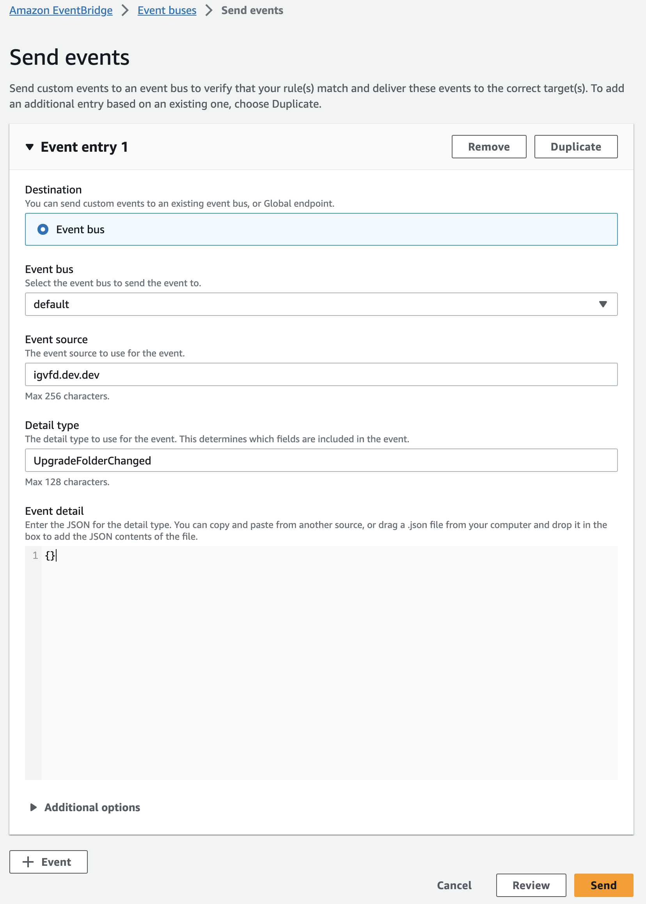
</p>

5. Click `Send` and watch for output in Slack.


---

## Trigger index creation

1. Follow [Trigger batch upgrade](#trigger-batch-upgrade) with UpdateMapping rule.

---

## Trigger reindexing

1. Log into running backend application container using [Log into running container](#log-into-running-container).

2. Set database URL: `# export SQLALCHEMY_URL=postgresql://postgres:${DB_PASSWORD}@${DB_HOST}/${DB_NAME}`.

3. Reindex all: `# python src/igvfd/commands/reindex.py config/pyramid/ini/${INI_NAME} --app-name app`.

4. Check `{backend_url}/indexer-info` for indexing progress.

---

## Flip a feature flag

1. Find application in AppConfig console:

<p align="center">
  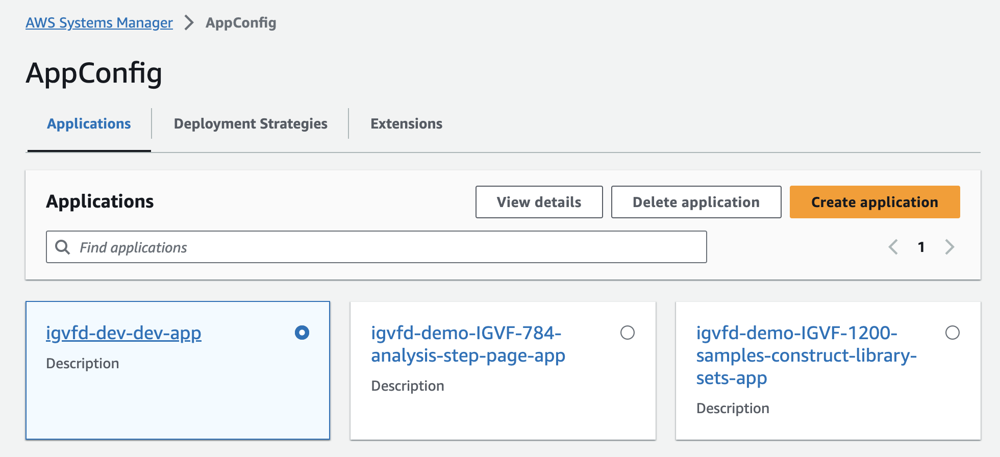
</p>

2. Click on configuration profile:

<p align="center">
  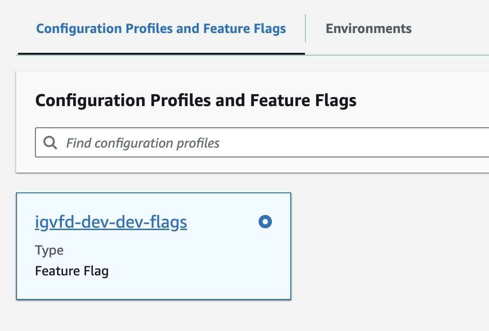
</p>

3. Toggle desired flag:

<p align="center">
  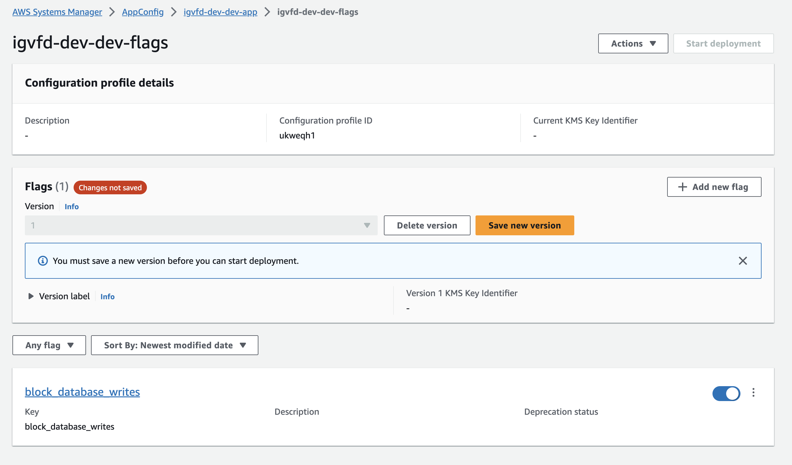
</p>

4. Click `Save new version` button and `Start deployment` button.

5. Select deployment method and deploy.

6. Check `{backend_url}/feature-flags` endpoint on backend application.

---

## Add new feature flag

1. Add a new feature flag key and value (True/False) to https://github.com/IGVF-DACC/igvfd/blob/dev/cdk/infrastructure/config.py for a specific environment:

<p align="center">
  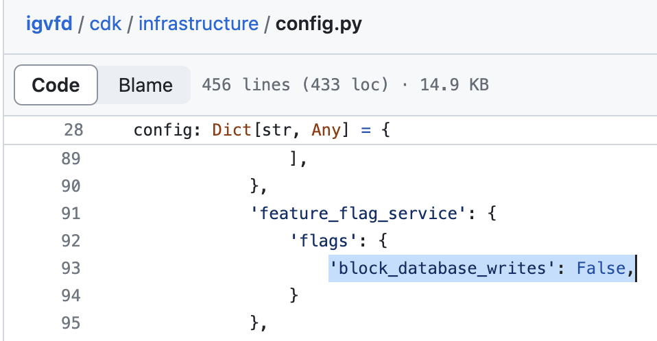
</p>

2. Make sure all flags in the config are set to desired state for next flag deployment (adding or changing any flag in the config will cause a new deployment of the flags, overwritting any flags toggled in the console).

3. Commit code and push.

---

## Connect to Postgres with psql

1. Log into running backend application container using [Log into running container](#log-into-running-container).

2. Install `psql` with `# apt-get update && apt-get install postgresql-client`.

3. Create database url with `# export SQLALCHEMY_URL=postgresql://postgres:${DB_PASSWORD}@${DB_HOST}/${DB_NAME}`.

4. Connect to database with `# psql $SQLALCHEMY_URL`.

---

## Connect to Opensearch

1. Log into running backend application container using [Log into running container](#log-into-running-container).

2. Query with cURL or Python client: `# curl -XGET ${OPENSEARCH_URL}/_cat/indices`.

---

## Restore database snapshot to lower environments

1. Delete `Backend`, `Opensearch`, and `Postgres` stacks in CloudFormation console.

2. Update `postgres` config in https://github.com/IGVF-DACC/igvfd/blob/dev/cdk/infrastructure/config.py for a specific environment with a new `snapshot_arn` or `snapshot_source_db_identifier` (or leave the same if you want latest snapshot from same source).

3. Commit code and push.

---

## Swap Opensearch

(Try swapping on demo instance first.)

1. Specify a new Opensearch cluster in https://github.com/IGVF-DACC/igvfd/blob/dev/cdk/infrastructure/config.py for a specific environment:

   a. Use a unique `construct_id` name (e.g. `Opensearch27`).

   b. Update the `backend` config to `write_to_opensearch_named` with the new `construct_id` name  (e.g. `Opensearch27`).

<p align="center">
  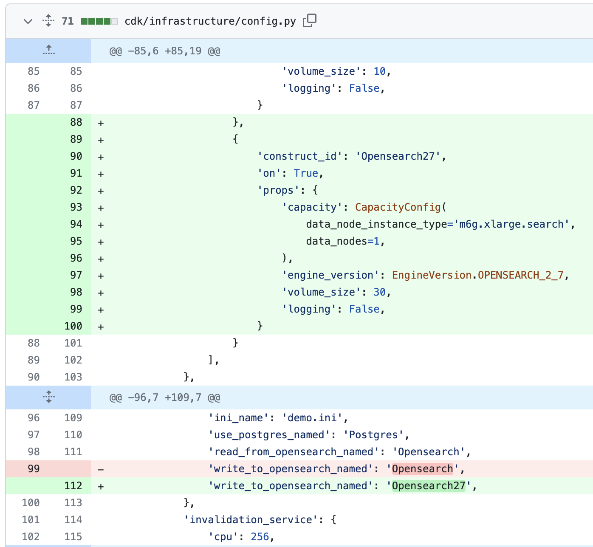
</p>

2. Commit, push, and deploy changes through all environments (dev, staging, sandbox, prod). For each environment:

   a. Index everything into the new cluster with [Trigger index creation](#trigger-index-creation) and [Trigger reindexing](#trigger-reindexing).

   b. Wait for indexing to finish (monitor indexing progress by number of documents metric in [Check Opensearch logs](#check-opensearch-logs)).

   c. Promote change to next environment and repeat (a) and (b).

3. Switch to reading from new cluster:

<p align="center">
  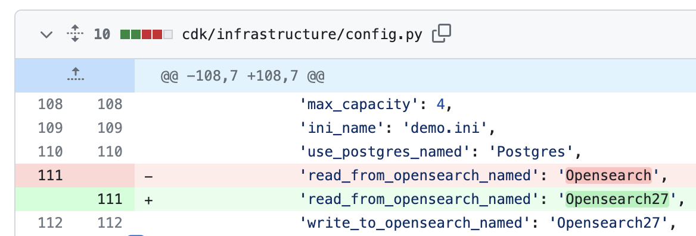
</p>

4. Commit, push, and deploy changes through all environments (dev, staging, sandbox, prod). For each environment:

   a. Make sure application is reading from new cluster (search results show up).

   b. Promote change to next environment and repeat (a).

5. Delete old cluster in config.py:

<p align="center">
  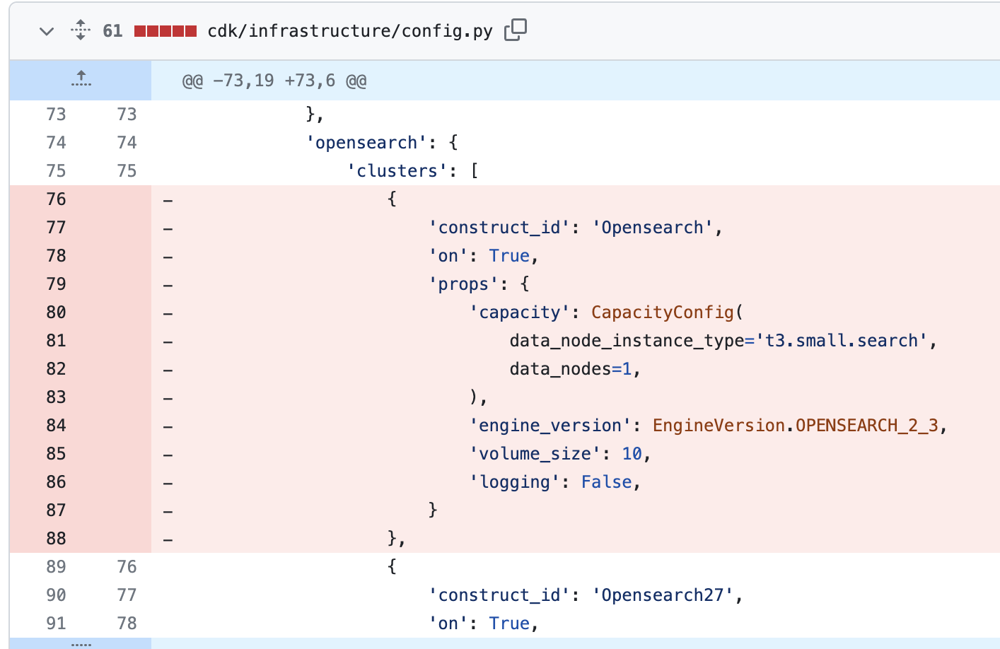
</p>

6. Commit, push, and deploy changes through all environments (dev, staging, sandbox, prod). For each environment:

   a. Check that old cluster is gone.

   b. Check that application is still serving search results from new cluster (search results show up).

   c. Promote change to next environment and repeat (a) and (b).

---

## Swap Postgres

Instructions for swapping Postgres.

---
