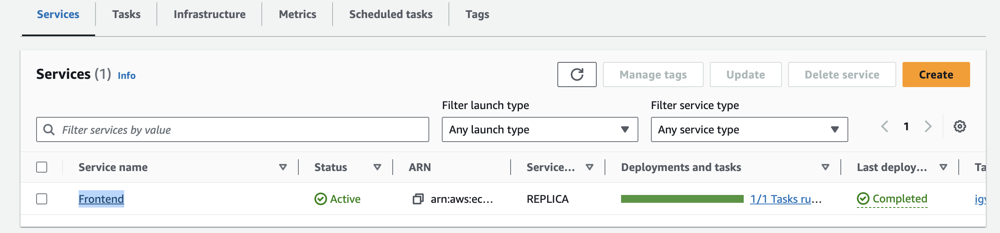
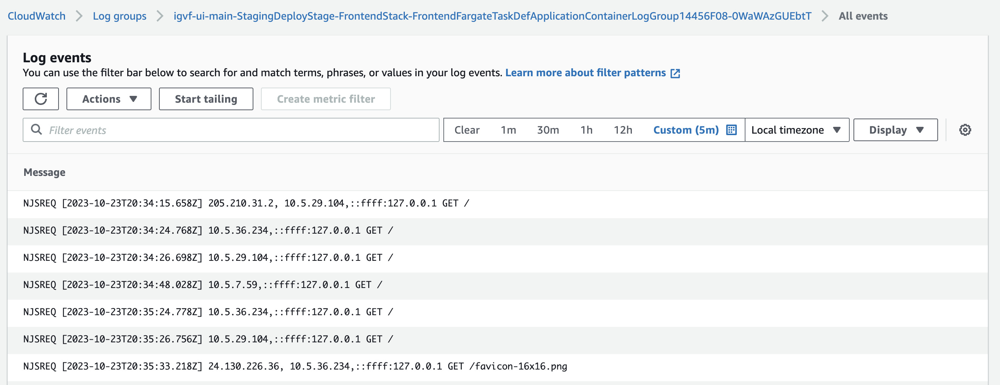

# Operations Guide

## Table of Contents

- [Debug release pipeline](#debug-release-pipeline)
- [Retrigger release pipeline](#retrigger-release-pipeline)
- [Check backend logs](#check-backend-logs)
- [Check frontend logs](#check-frontend-logs)
- [Check Postgres logs](#check-postgres-logs)
- [Check Opensearch logs](#check-opensearch-logs)
- [Check metrics](#check-metrics)
- [Log into running container](#log-into-running-container)
- [Debug indexing and clear dead-letter queue for indexing](#debug-indexing-and-clear-dead-letter-queue-for-indexing)
- [Trigger index creation](#trigger-index-creation)
- [Trigger batch upgrade](#trigger-batch-upgrade)
- [Trigger reindexing](#trigger-reindexing)
- [Flip a feature flag](#flip-a-feature-flag)
- [Add new feature flag](#add-new-feature-flag)
- [Connect to Postgres with psql](#connect-to-postgres-with-psql)
- [Connect to Opensearch](#connect-to-opensearch)
- [Restore database snapshot to lower environments](#restore-database-snapshot-to-lower-environments)
- [Swap Opensearch](#swap-opensearch)
- [Swap Postgres](#swap-postgres)

---

## Debug release pipeline

Guide on triggering the release pipeline.

---

## Retrigger release pipeline

1. Find pipeline in CodePipeline console:

<p align="center">
  
</p>

2. Click on `Release Change` button:

<p align="center">
  
</p>

---

## Check backend logs

Guide on how to check the backend logs.

---

## Check frontend logs

1. Find cluster in ECS console:

<p align="center">
  
</p>

2. Click on `Frontend` service:

<p align="center">
  
</p>

3. Click on `Logs` tab and `View in CloudWatch` button (select `ApplicationContainerLogGroup`):

<p align="center">
  
</p>

4. Add custom time range to narrow down logs:

<p align="center">
  
</p>

---

## Check Postgres logs

Steps to check Postgres logs.

---

## Check Opensearch logs

Guide to check Opensearch logs.

---

## Check metrics

Steps to check various metrics.

---

## Debug indexing and clear dead-letter queue for indexing

1. Find dead letter queue with messages in SQS console:

<p align="center">
  
</p>

2. Click on `Send and receive messages` button:

<p align="center">
  
</p>

3. Click on `Poll for messages` button:

<p align="center">
  
</p>

4. Open up the message to get the UUID of the object that failed to index:

<p align="center">
  
</p>

5. After cause has been investigated and fixed, click on `Start DLQ redrive` and `DLQ redrive` to send the messages back to primary queue for indexing.

<p align="center">
  
</p>

6. Monitor DLQ to make sure objects index correctly and messages don't reappear.

---

## Log into running container

1. Find cluster in ECS console:

<p align="center">
  
</p>

2. Click on desired service:

<p align="center">
  
</p>

3. Find task ID:

<p align="center">
  
</p>

4. Find container name (if task has multiple containers):

<p align="center">
  
</p>

5. Run command in terminal, filling in cluster, task, container name, and profile:

```bash
aws ecs execute-command \
    --command "/bin/bash" \
    --interactive \
    --cluster igvfd-dev-DeployDevelopment-BackendStack-EcsDefaultClusterMnL3mNNYNDemoVpc278C9613-7BVzDrMc52Ln \
    --task 26f42c00797144ec89393019c15c3d2b \
    --container pyramid \
    --profile igvf-dev
```

---

## Trigger index creation

Steps to trigger index creation.

---

## Trigger batch upgrade

Steps to trigger a batch upgrade.

---

## Trigger reindexing

Steps to trigger reindexing.

---

## Flip a feature flag

Guide on how to flip an existing feature flag.

---

## Add new feature flag

Instructions to add a new feature flag.

---

## Connect to Postgres with psql

Guide on how to connect to Postgres using psql.

---

## Connect to Opensearch

Instructions for connecting to Opensearch.

---

## Restore database snapshot to lower environments

Steps to restore a database snapshot to lower environments.

---

## Swap Opensearch

Instructions for swapping Opensearch.


<p align="center">
  
</p>

---

## Swap Postgres

Instructions for swapping Postgres.

---
