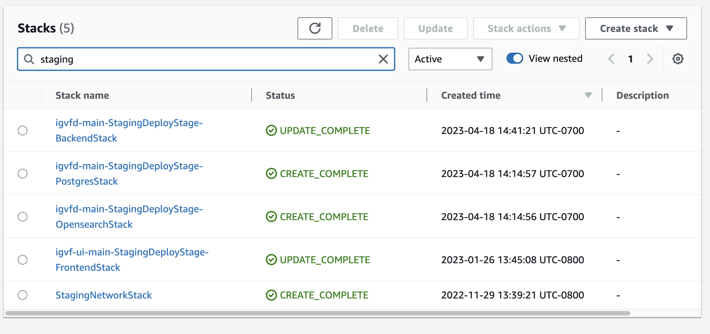

# Rebuild stacks to get up to date `production` DB snapshot

1. Log in to igvf-staging AWS account

2. Go to `CloudFormation/Stacks` and search for the relevant stacks, for example search for `staging`

3. Select `BackendStack` and `Delete` it

4. Only after `BackendStack` has finished to be deleted proceed to `PostgresStack` and `OpensearchStack`

5. If you merge the `PR` to main after these actions, the stacks you deleted would be rebuild with the new DB snapshot.
